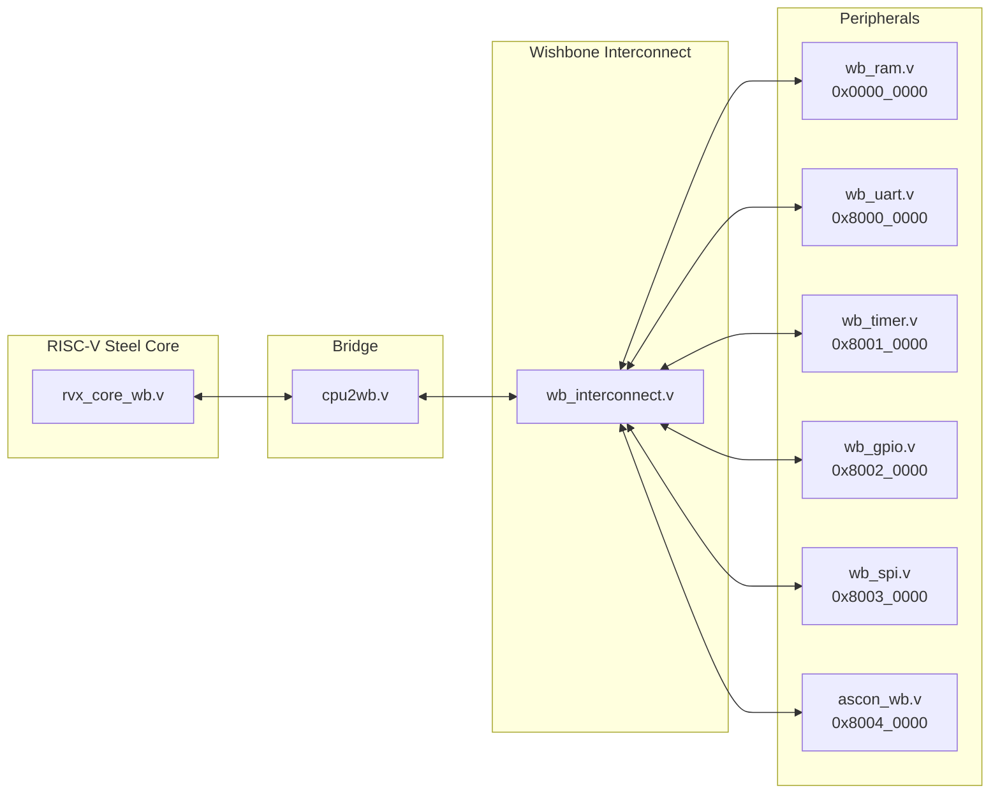

# Báo Cáo Phân Tích RVX_de2_FPGA
## Tích hợp ASCON với RISC-V Steel CPU qua Wishbone Bus

---

## 1. Tổng quan kiến trúc



---

## 2. Phân tích file

### 2.1 Files cần tích hợp vào ASCON project

| File | Vị trí | Mục đích | Priority |
|------|--------|----------|----------|
| **ascon_wb.v** | `RVX_de2_FPGA/ascon/` | Wishbone B4 slave wrapper cho ASCON | ⭐⭐⭐ CRITICAL |
| **wb_interconnect.v** | `RVX_de2_FPGA/main/` | Bus arbiter/decoder cho multi-slave | ⭐⭐⭐ CRITICAL |
| **cpu2wb.v** | `RVX_de2_FPGA/main/` | Bridge CPU native ↔ Wishbone | ⭐⭐⭐ CRITICAL |
| **mcu.v** | `RVX_de2_FPGA/main/` | Top-level MCU (reference) | ⭐⭐ EXAMPLE |

### 2.2 Files tham khảo (không bắt buộc)

| File | Size | Mục đích |
|------|------|----------|
| `rvx_core_wb.v` | 55KB | RISC-V Steel CPU (độc lập) |
| `wb_ram.v` | 3KB | Wishbone RAM template |
| `wb_uart.v` | 6KB | UART peripheral |
| `wb_gpio.v` | 4KB | GPIO peripheral |
| `wb_timer.v` | 5KB | Timer peripheral |
| `wb_spi.v` | 8KB | SPI peripheral |

---

## 3. Chi tiết ascon_wb.v

### 3.1 Register Map

| Address | Name | Access | Description |
|---------|------|--------|-------------|
| `0x00` | SETUP | W | `[0]=mode`, `[2:1]=crypt_variant` |
| `0x04` | START/STATUS | R/W | Write: Start op, Read: done_status |
| `0x08` | KEY | W | 32-bit key words (5x writes for 160-bit) |
| `0x0C` | NONCE | W | 32-bit nonce words (4x writes) |
| `0x10` | TAG | R/W | Tag input/output |
| `0x14` | AD | W | Associated data |
| `0x18` | PT/CT_OUT | R/W | Plaintext in / Ciphertext out |
| `0x1C` | CT/PT_OUT | R/W | Ciphertext in / Plaintext out |

### 3.2 Interface

```verilog
module ascon_wb #(
    parameter DATA_WIDTH = 32,
    parameter ADDR_WIDTH_WB = 32,
    parameter DATA_WIDTH_WB = 32
)(
    // System
    input wire clk, reset,
    
    // Wishbone Slave
    input  wire        wb_cyc_i, wb_stb_i, wb_we_i,
    input  wire [31:0] wb_adr_i, wb_dat_i,
    input  wire [3:0]  wb_sel_i,
    output wire        wb_ack_o,
    output wire [31:0] wb_dat_o,
    
    output wire done
);
```

---

## 4. Đề xuất cấu trúc ASCON project

```
ASCON/
├── rtl/
│   ├── core/                    (Existing)
│   │   ├── ascon_core_optimized.v
│   │   ├── ascon_top.v
│   │   ├── ascon_permutation.v
│   │   └── ... (helpers)
│   └── soc/                     (NEW - tích hợp từ RVX)
│       ├── ascon_wb.v           ← Wishbone wrapper
│       ├── wb_interconnect.v    ← Bus arbiter
│       └── cpu2wb.v             ← CPU bridge
├── tb/
├── constraints/
└── docs/
```

---

## 5. Kết luận

> [!IMPORTANT]
> **3 file bắt buộc** để tích hợp ASCON với RISC-V Steel CPU:
> 1. `ascon_wb.v` - Wishbone wrapper cho ASCON
> 2. `wb_interconnect.v` - Multi-slave bus decoder  
> 3. `cpu2wb.v` - CPU-to-Wishbone bridge

### Workflow tích hợp:
1. Copy 3 files trên vào `ASCON/rtl/soc/`
2. Update `ascon_wb.v` để instantiate `ascon_top` từ `ASCON/rtl/core/`
3. (Optional) Thêm `mcu.v` làm reference cho system integration

---

## 6. Memory Map Reference

| Device | Base Address | Size | Index |
|--------|--------------|------|-------|
| RAM | `0x0000_0000` | 8KB | D0 |
| UART | `0x8000_0000` | 256B | D1 |
| Timer | `0x8001_0000` | 32B | D2 |
| GPIO | `0x8002_0000` | 32B | D3 |
| SPI | `0x8003_0000` | 32B | D4 |
| **ASCON** | `0x8004_0000` | 32B | D5 |
